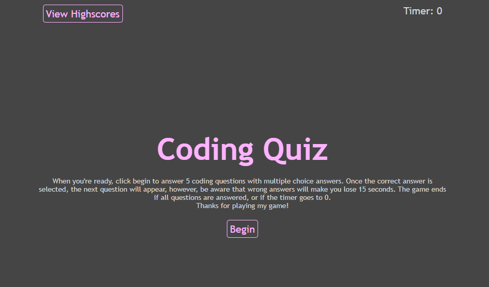

# timed-quiz

## Description
Challenge 4 -- Web APIs Timed Quiz

This project was to create a basic quiz on JavaScript fundamentals that is timed and logs highscores, of which are saved in local storage. The design is reponsive with contrasting colors so that it will be able to be played on any device for accessibility. Throughout this project I learned much more about JavaScript in general, using rem in css, and specifically with client-side/local storage, inserting HTML from js, querySelectors vs getElementById, eventListeners, and timers/setInterval.

## Usage

URL of deployed quiz website: 

Screenshot of completed site homepage:
 

## Credits
README template used from: https://coding-boot-camp.github.io/full-stack/github/professional-readme-guide edX Boot Camps LLC. (2022, October 27). Professional readme guide. Professional README Guide | The Full-Stack Blog. https://coding-boot-camp.github.io/full-stack/github/professional-readme-guide

Help on begining the JS code with questions showing including correct answer in variable array & the startings of the timer and end funtions from Boot Camp Tutor Team: Matthew Calimbas, see his work by visiting: https://github.com/MattyCalimbas
